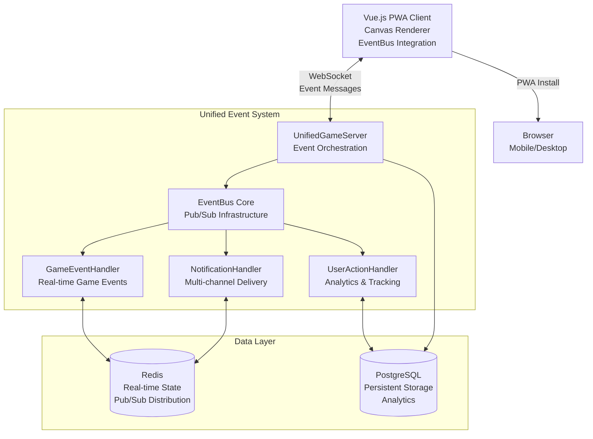

# Bomberman: Cooperative Multiplayer Game

A modern web-based implementation of the classic Bomberman game, reimagined for **cooperative multiplayer gameplay** where friends work together to complete objectives while avoiding friendly fire.

## 🎮 Game Concept

### Core Vision
Transform the traditional competitive Bomberman experience into a **cooperative team-based adventure** where players must collaborate to overcome challenges, defeat AI enemies, and achieve shared objectives.

### Key Features

#### **Cooperative Gameplay** 🤝
- **Team-focused mechanics**: Players work together rather than against each other
- **Friendly fire warnings**: System discourages accidental teammate damage
- **Shared objectives**: Victory requires team coordination and cooperation
- **10-second respawn system**: Eliminated players rejoin quickly to maintain team momentum

#### **Dynamic Objectives** 🎯
- **Boss Battles**: Coordinate attacks to defeat powerful AI bosses with multiple phases
- **Exit Gate Discovery**: Systematically explore maze to find hidden exit gates
- **Gate Destruction Consequences**: Accidentally destroying gates spawns monster waves
- **Escalating Difficulty**: Each destroyed gate increases monster power and spawn rates
- **Survival Mode**: If all gates are destroyed, objectives shift to endless survival

#### **Real-time Multiplayer** 🌐
- **WebSocket-based communication**: Low-latency real-time synchronization
- **Room-based sessions**: Create shareable rooms for friends to join
- **Cross-platform compatibility**: Play on desktop and mobile browsers
- **Reconnection support**: Automatic reconnection with state recovery

#### **Mobile-First Design** 📱
- **Progressive Web App (PWA)**: Install as native app on mobile devices
- **Touch controls**: Virtual joystick and haptic feedback for mobile
- **Responsive UI**: Adapts to different screen sizes and orientations
- **Offline capabilities**: Practice mode available without internet connection

#### **Strategic Gameplay Elements** ⚡
- **Power-up system**: Enhance bomb capacity, blast radius, and special abilities
- **AI Monster variety**: Different enemy types with unique behaviors and tactics
- **Minimap navigation**: Strategic overview with fog of war mechanics
- **Environmental destruction**: Destructible mazes that change as you play

## 🏗️ Implementation Architecture

### Technology Stack

#### **Frontend (Client)**
- **Vue.js 3** with Composition API for reactive UI components
- **TypeScript** for type-safe development and better code maintainability
- **HTML5 Canvas** for high-performance 2D game rendering
- **PWA technologies** (Service Workers, Web App Manifest) for native app experience
- **WebSocket client** integrated with unified EventBus system

#### **Backend (Server)**
- **Node.js** with **Koa.js** framework for lightweight, fast server
- **TypeScript** for consistent full-stack type safety
- **Unified EventBus** architecture for maximum code reuse across all event types
- **WebSocket server** with event-driven message routing
- **Specialized event handlers** for games, notifications, user actions, and admin events

#### **Infrastructure**
- **Docker containerization** for consistent deployment environments
- **Redis** for real-time event distribution and pub/sub messaging
- **PostgreSQL** for persistent game data, user statistics, and audit logs
- **Nginx** for load balancing and static asset serving
- **Dual-storage architecture** optimized for both real-time and persistent data

### System Architecture



### Core Modules

#### **Unified EventBus System**
- **Universal Event Infrastructure**: Single pub/sub system for all event types
- **Specialized Handlers**: Game events, user notifications, user actions, admin events
- **Event Routing**: Context-aware delivery with filtering and priorities
- **Performance Optimization**: Batching, compression, intelligent caching

#### **GameEventHandler**
- **Real-time Game Events**: Player actions, bomb explosions, power-ups, boss battles
- **State Synchronization**: Authoritative server state with delta updates
- **Team Coordination**: Cooperative gameplay events and friendly fire warnings
- **AI Systems**: Monster behavior, pathfinding, boss mechanics

#### **UserNotificationHandler**
- **Multi-channel Delivery**: In-game, WebSocket, email, push notifications
- **Notification Templates**: Reusable notification formats with variables
- **User Preferences**: Channel preferences, quiet hours, frequency limits
- **Engagement Analytics**: Read receipts, click-through rates, user behavior

#### **UserActionHandler**
- **Comprehensive Tracking**: All user interactions and behavior analysis
- **Analytics Pipeline**: Pattern detection, conversion funnels, A/B testing
- **Personalization**: Action recommendations and user segmentation
- **Anomaly Detection**: Unusual behavior patterns and security monitoring

#### **Progressive Web App**
- **Service Worker**: Asset caching and offline functionality
- **Installation prompts**: Native app installation experience
- **EventBus Integration**: Offline event queuing and synchronization
- **Push notifications**: Real-time game invitations and updates

#### **Admin Dashboard**
- **Real-time Monitoring**: Unified metrics across all event types
- **Event-driven Moderation**: Automated responses to user actions
- **Advanced Analytics**: Cross-system insights and performance metrics
- **Dynamic Configuration**: Real-time system parameter adjustments

## 📖 Project Documentation

Comprehensive documentation is available in the `docs/` directory:

### **Use Cases**
- [`docs/use-cases/gamer.md`](docs/use-cases/gamer.md) - Player user stories and scenarios
- [`docs/use-cases/admin.md`](docs/use-cases/admin.md) - Administrative use cases and workflows

### **System Design**
- [`docs/sequence-diagrams/`](docs/sequence-diagrams/) - Detailed interaction flows with unified EventBus integration
- [`docs/architecture/unified-event-system.md`](docs/architecture/unified-event-system.md) - Complete EventBus architecture documentation
- [`docs/schema/`](docs/schema/) - Complete data models and entity definitions
- [`docs/modules.md`](docs/modules.md) - Module architecture with dual-storage system
- [`docs/tech-stack.md`](docs/tech-stack.md) - Complete technology stack with Redis/PostgreSQL integration

### **Data Models**
- [`docs/schema/game.md`](docs/schema/game.md) - Game state, bombs, power-ups, maze entities
- [`docs/schema/player.md`](docs/schema/player.md) - Player data, abilities, achievements, sessions
- [`docs/schema/room.md`](docs/schema/room.md) - Multiplayer rooms, lobbies, chat systems
- [`docs/schema/monster.md`](docs/schema/monster.md) - AI enemies, bosses, combat mechanics
- [`docs/schema/admin.md`](docs/schema/admin.md) - Administrative users, logs, system configuration
- [`docs/schema/websocket.md`](docs/schema/websocket.md) - Real-time communication protocols

## 🚀 Getting Started

> **Note**: Implementation is currently in the design and planning phase. The following setup instructions will be available once development begins.

### Prerequisites
- Node.js 18+ and npm/yarn
- Docker and Docker Compose (for local development)
- Modern web browser with WebSocket and Canvas support

### Development Setup
```bash
# Clone the repository
git clone https://github.com/alexmakeev/bomberman.git
cd bomberman

# Install dependencies
npm install

# Start development environment
docker-compose up -d

# Run development server
npm run dev
```

### Production Deployment
```bash
# Build for production
npm run build

# Deploy with Docker
docker-compose -f docker-compose.prod.yml up -d
```

## 🎯 Game Mechanics Deep Dive

### **Cooperative Elements**
- **Team Revival**: Dead players respawn automatically after 10 seconds
- **Shared Resources**: Power-ups benefit the entire team's strategy
- **Communication**: Visual cues and movement patterns for coordination
- **Joint Objectives**: All players must reach exit gate for victory

### **AI Challenge System**
- **Dynamic Difficulty**: Monster strength scales with team performance
- **Behavioral Variety**: Different AI types require different strategies
- **Boss Encounters**: Multi-phase battles requiring team coordination
- **Wave Mechanics**: Gate destruction triggers escalating monster waves

### **Strategic Depth**
- **Risk vs Reward**: Destroying walls may reveal gates or spawn enemies
- **Resource Management**: Limited bombs require tactical placement
- **Map Knowledge**: Learning maze layouts and optimal paths
- **Team Composition**: Different players can specialize in different roles

## 🔒 Security & Privacy

- **Input validation**: All player actions validated server-side
- **Rate limiting**: Prevents spam and abuse
- **Secure communication**: WSS (WebSocket Secure) for encrypted data
- **Privacy-first**: Minimal data collection, GDPR compliant
- **Anti-cheat measures**: Server-authoritative game state

## 📈 Planned Features & Roadmap

### **Phase 1: Core Game** (Current)
- [x] System architecture design
- [x] Documentation and specifications
- [ ] Basic game engine implementation
- [ ] WebSocket multiplayer foundation
- [ ] Simple maze generation and rendering

### **Phase 2: Multiplayer Experience**
- [ ] Room creation and joining
- [ ] Real-time player synchronization
- [ ] Chat system and communication
- [ ] Mobile touch controls
- [ ] PWA installation flow

### **Phase 3: Game Content**
- [ ] AI monster system
- [ ] Boss battles and phases
- [ ] Power-up variety and effects
- [ ] Multiple maze themes and layouts
- [ ] Achievement system

### **Phase 4: Polish & Scale**
- [ ] Admin dashboard and moderation tools
- [ ] Analytics and reporting
- [ ] Performance optimization
- [ ] Load testing and scaling
- [ ] Community features

## 🤝 Contributing

Contributions are welcome! This project is in active development. Please see the documentation in `docs/` for architecture and implementation details.

### **Development Guidelines**
- Follow TypeScript strict mode and type safety
- Use Vue 3 Composition API patterns
- Maintain real-time performance requirements
- Write tests for critical game mechanics
- Follow the established module architecture

## 📄 License

This project is licensed under the MIT License - see the [LICENSE](LICENSE) file for details.

## 🙏 Acknowledgments

- Inspired by the classic Bomberman series by Hudson Soft
- Built for modern web technologies and cooperative gameplay
- Designed for cross-platform accessibility and mobile-first experience

---

**Ready to bomb some walls and defeat monsters together?** 💣🎮

*This project prioritizes fun, teamwork, and accessibility in a modern web-based gaming experience.*