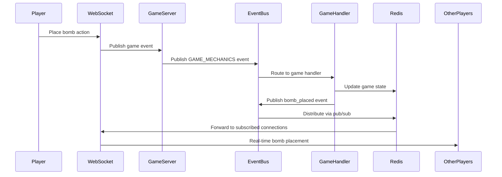
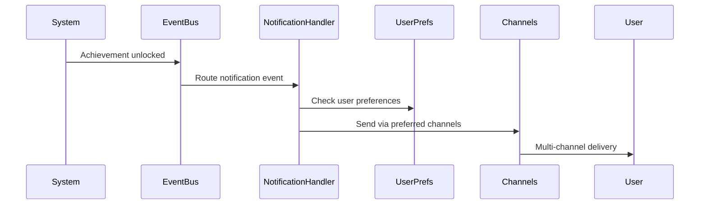
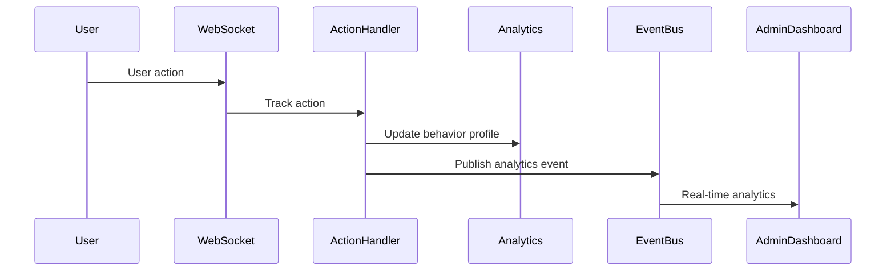

# Unified Event System Architecture

This document describes the comprehensive event-driven architecture that maximizes code reuse across all system components through a unified EventBus infrastructure.

## System Overview

The Bomberman multiplayer game uses a **unified event system** that handles:

- **Game Events**: Player actions, state changes, mechanics
- **User Notifications**: Achievements, invitations, system messages  
- **User Actions**: Input tracking, analytics, behavior analysis
- **Admin Events**: Moderation, configuration, monitoring
- **System Events**: Performance, security, status updates

## Architecture Components

### 1. Core EventBus (`src/interfaces/core/EventBus.d.ts`)

The foundation component providing:
- **Universal Event Format**: Single event interface for all event types
- **Flexible Pub/Sub**: Category-based subscriptions with filtering
- **Multiple Delivery Modes**: Fire-and-forget, at-least-once, exactly-once
- **Event Persistence**: Redis for real-time, PostgreSQL for historical
- **Performance Optimization**: Batching, compression, priority queues

```typescript
// Universal event that works for all use cases
interface UniversalEvent<TData = any> {
  eventId: EntityId;
  category: EventCategory;  // GAME_STATE, USER_NOTIFICATION, etc.
  type: string;             // Specific event type within category
  sourceId: EntityId;
  targets: EventTarget[];   // Who should receive this event
  data: TData;              // Event payload
  metadata: EventMetadata;  // Priority, TTL, delivery options
  timestamp: Timestamp;
  version: string;
}
```

### 2. Specialized Event Handlers

#### GameEventHandler (`src/modules/GameEventHandlerImpl/`)
- **Game-specific events**: Player moves, bomb explosions, power-ups
- **Real-time optimization**: High-frequency updates, delta compression
- **Team coordination**: Cooperative gameplay events, friendly fire warnings
- **State management**: Game state reconstruction from events
- **Module Integration**: Works with BombManager, PlayerStateManager, MazeGenerator

#### UserNotificationHandler (`src/modules/UserNotificationHandlerImpl/`)
- **Multi-channel delivery**: In-game, WebSocket, browser notifications
- **Notification templates**: Reusable notification formats with dynamic content
- **User preferences**: Channel preferences, frequency limits, achievement settings
- **Delivery analytics**: Tracking delivery success, read rates, engagement
- **Real-time Integration**: Cooperative game achievements, team coordination alerts

#### UserActionHandler (`src/modules/UserActionHandlerImpl/`)
- **Action tracking**: All user interactions, gameplay patterns, behavior analysis
- **Analytics pipeline**: Pattern detection, skill assessment, progression tracking
- **Player Segmentation**: Automatic categorization based on behavior patterns
- **Anomaly detection**: Unusual behavior patterns, potential cheating detection
- **Performance Analytics**: Reaction times, success rates, learning curves

### 6. Frontend Integration (`src/frontend/`)

#### Vue 3 Application
- **Component Architecture**: Game canvas, HUD, minimap, mobile controls
- **State Management**: Pinia stores for game state, player state, connection status
- **Real-time Updates**: WebSocket integration with reactive UI updates
- **Mobile Optimization**: Touch controls, responsive design, PWA capabilities
- **EventBus Connection**: Receives events via WebSocket for real-time gameplay

### 3. WebSocket Integration (`src/modules/WebSocketHandler/`)

Enhanced WebSocket management with EventBus integration:
- **Event-driven messaging**: All WebSocket messages converted to EventBus events
- **Auto-subscription**: Context-aware event subscriptions based on game state
- **Connection Management**: Authentication, rate limiting, graceful disconnection
- **Real-time synchronization**: Sub-100ms event distribution to clients
- **Performance Optimization**: Message batching, compression, priority queues

### 4. Unified GameServer (`src/modules/UnifiedGameServerImpl/`)

Central orchestration layer that coordinates all game modules:
- **EventBus integration**: Direct access to all specialized handlers
- **Module Coordination**: Integrates BombManager, PlayerStateManager, MazeGenerator, etc.
- **WebSocket Management**: Real-time client communication and broadcasting
- **Room & Game Lifecycle**: Complete multiplayer session management
- **Performance monitoring**: Comprehensive metrics across all systems
- **Configuration Management**: Environment-based settings and runtime parameters

### 5. Game-Specific Modules

#### BombManager (`src/modules/BombManager/`)
- **Bomb Lifecycle**: Placement validation, timer management, explosion triggers
- **Chain Reactions**: Bombs triggering other bombs for combo effects
- **Damage Calculation**: Cross-pattern explosions with wall destruction
- **Performance Optimization**: Efficient processing for smooth multiplayer
- **EventBus Integration**: Publishes bomb_placed, bomb_exploded, chain_reaction events

#### PlayerStateManager (`src/modules/PlayerStateManager/`)
- **Player Lifecycle**: Position tracking, health management, respawn coordination
- **State Synchronization**: Real-time position updates across all clients
- **Statistics Tracking**: Performance metrics, achievements, progression
- **Respawn Logic**: 10-second countdown, corner position spawning
- **EventBus Integration**: Publishes player_moved, player_eliminated, player_respawned events

#### MazeGenerator (`src/modules/MazeGenerator/`)
- **Procedural Generation**: Classic Bomberman grid with strategic placement
- **Dynamic Content**: Power-ups hidden under destructible walls
- **Gate Placement**: Exit points with monster wave consequences
- **Balance Validation**: Ensures fair and playable maze layouts
- **EventBus Integration**: Publishes maze_generated, wall_destroyed, gate_revealed events

#### CollisionDetector (`src/modules/CollisionDetector/`)
- **High-Performance Detection**: Sub-millisecond collision calculations
- **Multi-Entity Support**: Players, bombs, walls, power-ups, monsters
- **Movement Validation**: Prevents invalid player positions
- **Explosion Hit Detection**: Determines entities affected by bomb blasts
- **EventBus Integration**: Publishes collision_detected, powerup_collected events

#### PowerUpManager (`src/modules/PowerUpManager/`)
- **Effect Management**: Bomb upgrades, speed boosts, special abilities
- **Collection Processing**: Validates and applies power-up effects
- **Player Enhancement**: Stacking effects, temporary abilities
- **Balance Control**: Configurable spawn rates and effect durations
- **EventBus Integration**: Publishes powerup_spawned, powerup_collected, effect_applied events

## Event Flow Examples

### 1. Game Action Flow


### 2. Notification Flow


### 3. Action Tracking Flow


## Code Reuse Benefits

### 1. **Single Event Infrastructure**
- One pub/sub system handles all event types
- Consistent error handling and retry logic
- Unified monitoring and debugging tools
- Shared performance optimizations

### 2. **Composable Event Handlers**
- Specialized handlers extend the base EventBus
- Mix and match functionality as needed
- Easy to add new event types and handlers
- Consistent interfaces across all handlers

### 3. **WebSocket Integration**
- All WebSocket messages use the event system
- Automatic routing based on subscriptions
- Context-aware delivery optimization
- Unified connection management

### 4. **Cross-System Communication**
```typescript
// Game events can trigger notifications
gameEventHandler.onEvent('player_eliminated', async (event) => {
  await notificationHandler.sendNotification(event.data.playerId, {
    type: 'ACHIEVEMENT',
    title: 'Better luck next time!',
    content: 'You were eliminated but can respawn in 10 seconds'
  });
});

// User actions can trigger game events
userActionHandler.onEvent('admin_action', async (event) => {
  if (event.data.action === 'kick_player') {
    await gameEventHandler.publishPlayerEliminated({
      playerId: event.data.targetId,
      cause: 'admin_kick',
      // ... other data
    });
  }
});
```

## Implementation Patterns

### 1. **Event Categories as Modules**
```typescript
// Each category maps to specialized functionality
const eventCategories = {
  GAME_STATE: gameEventHandler,
  USER_NOTIFICATION: notificationHandler, 
  USER_ACTION: userActionHandler,
  ADMIN_ACTION: adminEventHandler,
  SYSTEM_STATUS: systemEventHandler
};
```

### 2. **Layered Architecture**
```
┌─────────────────────────────────────────┐
│           WebSocket Layer               │ ← Client connections
├─────────────────────────────────────────┤
│        Specialized Handlers             │ ← Domain-specific logic
├─────────────────────────────────────────┤
│           Unified EventBus              │ ← Core event infrastructure
├─────────────────────────────────────────┤
│        Storage Layer (Redis/PG)         │ ← Persistence & pub/sub
└─────────────────────────────────────────┘
```

### 3. **Configuration-Driven Behavior**
```typescript
// Single configuration controls all event behavior
const eventConfig: EventBusConfig = {
  defaultTTL: 300000,           // 5 minutes
  maxEventSize: 1024 * 1024,    // 1MB
  enablePersistence: true,      // Use PostgreSQL
  enableTracing: true,          // Debug support
  batchSize: 100,               // Performance optimization
  compressionLevel: 6           // Network optimization
};
```

## Performance Optimizations

### 1. **Event Batching**
- Batch high-frequency events (game state updates)
- Configurable batch size and timeout
- Reduces network overhead and processing load

### 2. **Smart Routing**
- Events only sent to relevant subscribers
- Context-aware filtering reduces noise
- Priority-based delivery for critical events

### 3. **Caching and Persistence**
- Redis for real-time event distribution
- PostgreSQL for long-term storage and analytics
- Automatic cleanup of expired events

### 4. **Compression and Encoding**
- Optional message compression for bandwidth
- Binary encoding for high-frequency events
- Adaptive compression based on network conditions

## Monitoring and Debugging

### 1. **Unified Metrics**
```typescript
interface EventSystemMetrics {
  totalEvents: number;
  eventsByCategory: Record<EventCategory, number>;
  averageProcessingTime: number;
  errorCount: number;
  subscriptionMetrics: SubscriptionMetrics;
}
```

### 2. **Event Tracing**
- Trace events across all system components
- Performance profiling and bottleneck identification
- Debug event routing and delivery issues

### 3. **Health Monitoring**
- Component health checks (Redis, PostgreSQL, WebSocket)
- Performance indicators and alerting
- Automatic failover and recovery

## Extensibility

### 1. **Adding New Event Types**
```typescript
// 1. Define new event category
enum EventCategory {
  // ... existing categories
  MARKETPLACE = 'marketplace'  // New category
}

// 2. Create specialized handler
interface MarketplaceEventHandler extends EventBus {
  publishItemPurchase(data: ItemPurchaseData): Promise<EventPublishResult>;
  subscribeToUserPurchases(userId: EntityId, handler: EventHandler): Promise<void>;
}

// 3. Integrate with GameServer
interface UnifiedGameServer {
  readonly marketplace: MarketplaceEventHandler;  // Auto-available
}
```

### 2. **Custom Event Middleware**
```typescript
// Add custom processing to any event category
server.addEventMiddleware(EventCategory.GAME_STATE, async (event, next) => {
  // Custom validation, logging, transformation
  if (event.type === 'player_move') {
    // Anti-cheat validation
    await validatePlayerMovement(event.data);
  }
  await next();
});
```

This unified event system provides maximum code reuse while maintaining high performance and flexibility for the multiplayer Bomberman game's diverse event handling needs.