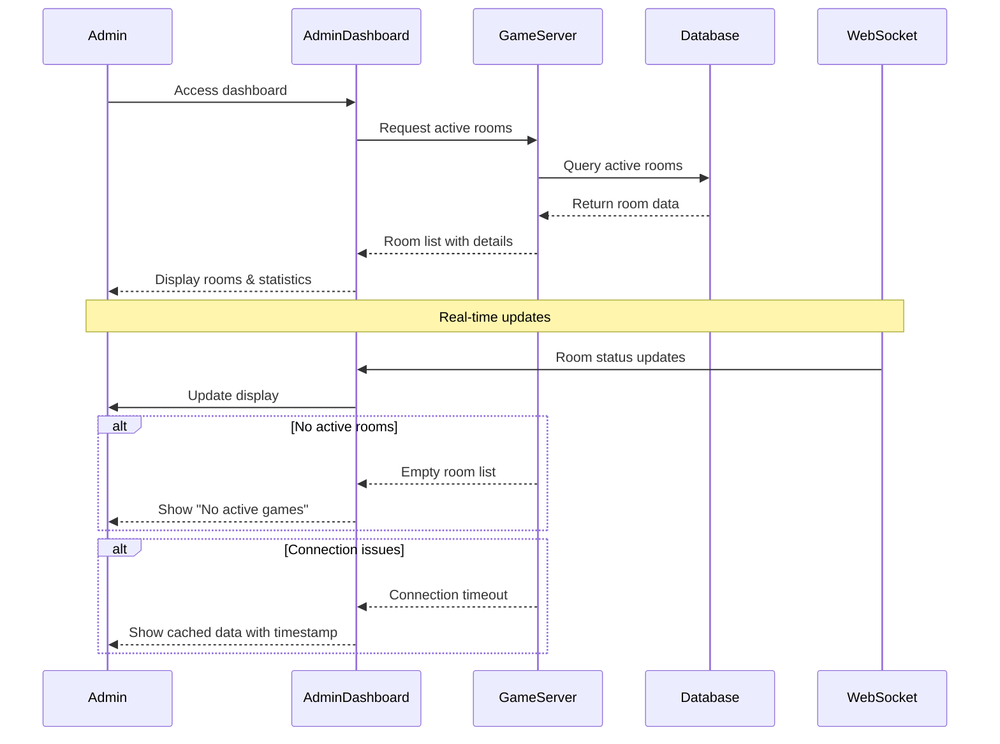

# UC-A001: Monitor Game Rooms - Sequence Diagram

```mermaid
sequenceDiagram
    participant Admin
    participant AdminDashboard
    participant GameServer
    participant Database
    participant WebSocket

    Admin->>AdminDashboard: Access dashboard
    AdminDashboard->>GameServer: Request active rooms
    GameServer->>Database: Query active rooms
    Database-->>GameServer: Return room data
    GameServer-->>AdminDashboard: Room list with details
    AdminDashboard-->>Admin: Display rooms & statistics

    Note over Admin,WebSocket: Real-time updates
    WebSocket->>AdminDashboard: Room status updates
    AdminDashboard->>Admin: Update display

    alt No active rooms
        GameServer-->>AdminDashboard: Empty room list
        AdminDashboard-->>Admin: Show "No active games"
    end

    alt Connection issues
        GameServer-->>AdminDashboard: Connection timeout
        AdminDashboard-->>Admin: Show cached data with timestamp
    end
```