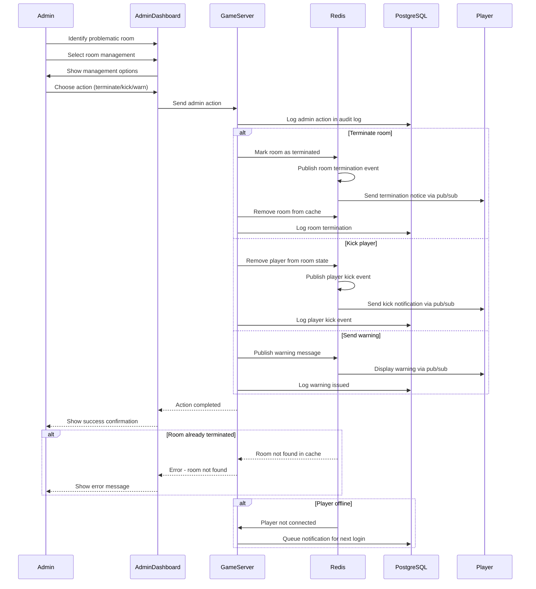

# UC-A002: Manage Game Rooms - Sequence Diagram

```mermaid
sequenceDiagram
    participant Admin
    participant AdminDashboard
    participant GameServer
    participant Redis
    participant PostgreSQL
    participant Player

    Admin->>AdminDashboard: Identify problematic room
    Admin->>AdminDashboard: Select room management
    AdminDashboard->>Admin: Show management options
    Admin->>AdminDashboard: Choose action (terminate/kick/warn)
    
    AdminDashboard->>GameServer: Send admin action
    GameServer->>PostgreSQL: Log admin action in audit log
    
    alt Terminate room
        GameServer->>Redis: Mark room as terminated
        Redis->>Redis: Publish room termination event
        Redis->>Player: Send termination notice via pub/sub
        GameServer->>Redis: Remove room from cache
        GameServer->>PostgreSQL: Log room termination
    else Kick player
        GameServer->>Redis: Remove player from room state
        Redis->>Redis: Publish player kick event
        Redis->>Player: Send kick notification via pub/sub
        GameServer->>PostgreSQL: Log player kick event
    else Send warning
        GameServer->>Redis: Publish warning message
        Redis->>Player: Display warning via pub/sub
        GameServer->>PostgreSQL: Log warning issued
    end
    
    GameServer-->>AdminDashboard: Action completed
    AdminDashboard-->>Admin: Show success confirmation

    alt Room already terminated
        Redis-->>GameServer: Room not found in cache
        GameServer-->>AdminDashboard: Error - room not found
        AdminDashboard-->>Admin: Show error message
    end

    alt Player offline
        Redis->>GameServer: Player not connected
        GameServer->>PostgreSQL: Queue notification for next login
    end
```