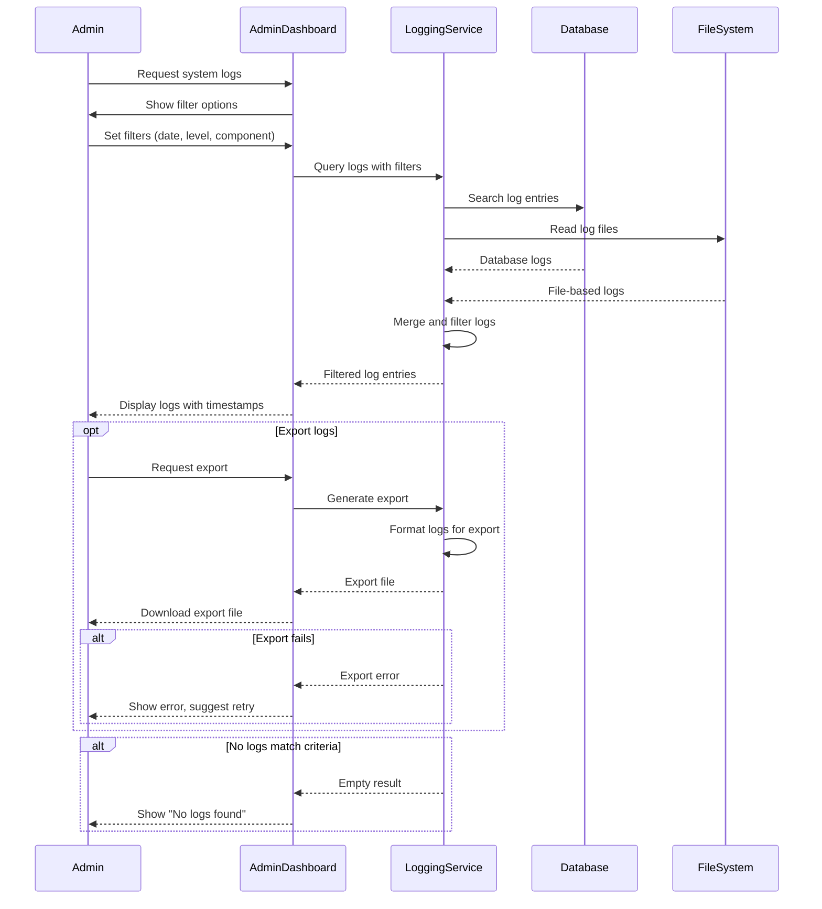

# UC-A003: View System Logs - Sequence Diagram

```mermaid
sequenceDiagram
    participant Admin
    participant AdminDashboard
    participant LoggingService
    participant Database
    participant FileSystem

    Admin->>AdminDashboard: Request system logs
    AdminDashboard->>Admin: Show filter options
    Admin->>AdminDashboard: Set filters (date, level, component)
    
    AdminDashboard->>LoggingService: Query logs with filters
    LoggingService->>Database: Search log entries
    LoggingService->>FileSystem: Read log files
    
    Database-->>LoggingService: Database logs
    FileSystem-->>LoggingService: File-based logs
    
    LoggingService->>LoggingService: Merge and filter logs
    LoggingService-->>AdminDashboard: Filtered log entries
    AdminDashboard-->>Admin: Display logs with timestamps

    opt Export logs
        Admin->>AdminDashboard: Request export
        AdminDashboard->>LoggingService: Generate export
        LoggingService->>LoggingService: Format logs for export
        LoggingService-->>AdminDashboard: Export file
        AdminDashboard-->>Admin: Download export file
        
        alt Export fails
            LoggingService-->>AdminDashboard: Export error
            AdminDashboard-->>Admin: Show error, suggest retry
        end
    end

    alt No logs match criteria
        LoggingService-->>AdminDashboard: Empty result
        AdminDashboard-->>Admin: Show "No logs found"
    end
```