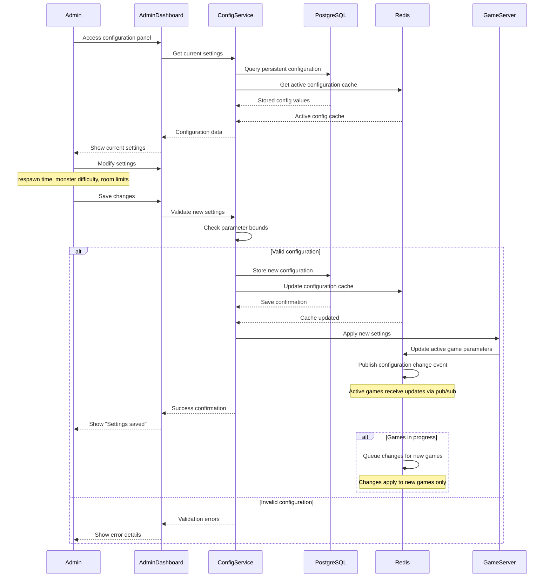

# UC-A004: Configure Game Parameters - Sequence Diagram

```mermaid
sequenceDiagram
    participant Admin
    participant AdminDashboard
    participant ConfigService
    participant PostgreSQL
    participant Redis
    participant GameServer

    Admin->>AdminDashboard: Access configuration panel
    AdminDashboard->>ConfigService: Get current settings
    ConfigService->>PostgreSQL: Query persistent configuration
    ConfigService->>Redis: Get active configuration cache
    PostgreSQL-->>ConfigService: Stored config values
    Redis-->>ConfigService: Active config cache
    ConfigService-->>AdminDashboard: Configuration data
    AdminDashboard-->>Admin: Show current settings

    Admin->>AdminDashboard: Modify settings
    Note over Admin: respawn time, monster difficulty, room limits
    Admin->>AdminDashboard: Save changes
    
    AdminDashboard->>ConfigService: Validate new settings
    ConfigService->>ConfigService: Check parameter bounds
    
    alt Valid configuration
        ConfigService->>PostgreSQL: Store new configuration
        ConfigService->>Redis: Update configuration cache
        PostgreSQL-->>ConfigService: Save confirmation
        Redis-->>ConfigService: Cache updated
        ConfigService->>GameServer: Apply new settings
        
        GameServer->>Redis: Update active game parameters
        Redis->>Redis: Publish configuration change event
        Note over Redis: Active games receive updates via pub/sub
        
        ConfigService-->>AdminDashboard: Success confirmation
        AdminDashboard-->>Admin: Show "Settings saved"
        
        alt Games in progress
            Redis->>Redis: Queue changes for new games
            Note over Redis: Changes apply to new games only
        end
    else Invalid configuration
        ConfigService-->>AdminDashboard: Validation errors
        AdminDashboard-->>Admin: Show error details
    end
```