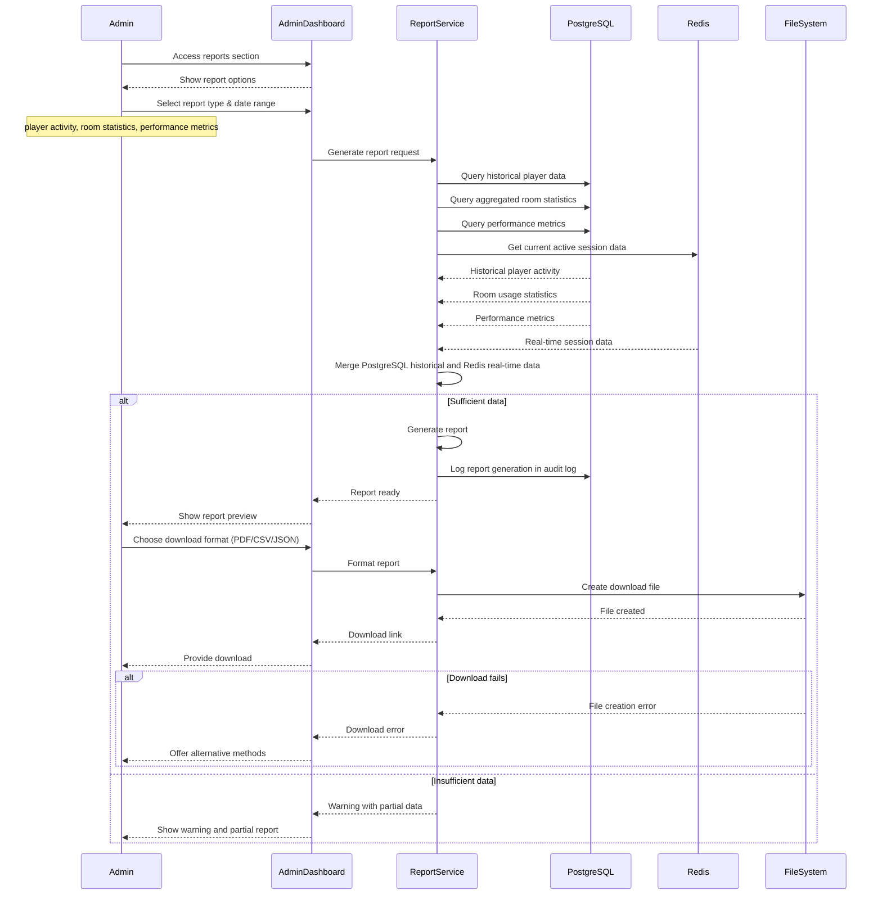

# UC-A005: Generate Reports - Sequence Diagram

```mermaid
sequenceDiagram
    participant Admin
    participant AdminDashboard
    participant ReportService
    participant PostgreSQL
    participant Redis
    participant FileSystem

    Admin->>AdminDashboard: Access reports section
    AdminDashboard-->>Admin: Show report options
    Admin->>AdminDashboard: Select report type & date range
    Note over Admin: player activity, room statistics, performance metrics
    
    AdminDashboard->>ReportService: Generate report request
    ReportService->>PostgreSQL: Query historical player data
    ReportService->>PostgreSQL: Query aggregated room statistics
    ReportService->>PostgreSQL: Query performance metrics
    ReportService->>Redis: Get current active session data
    
    PostgreSQL-->>ReportService: Historical player activity
    PostgreSQL-->>ReportService: Room usage statistics
    PostgreSQL-->>ReportService: Performance metrics
    Redis-->>ReportService: Real-time session data
    
    ReportService->>ReportService: Merge PostgreSQL historical and Redis real-time data
    
    alt Sufficient data
        ReportService->>ReportService: Generate report
        ReportService->>PostgreSQL: Log report generation in audit log
        ReportService-->>AdminDashboard: Report ready
        AdminDashboard-->>Admin: Show report preview
        
        Admin->>AdminDashboard: Choose download format (PDF/CSV/JSON)
        AdminDashboard->>ReportService: Format report
        ReportService->>FileSystem: Create download file
        FileSystem-->>ReportService: File created
        ReportService-->>AdminDashboard: Download link
        AdminDashboard-->>Admin: Provide download
        
        alt Download fails
            FileSystem-->>ReportService: File creation error
            ReportService-->>AdminDashboard: Download error
            AdminDashboard-->>Admin: Offer alternative methods
        end
    else Insufficient data
        ReportService-->>AdminDashboard: Warning with partial data
        AdminDashboard-->>Admin: Show warning and partial report
    end
```