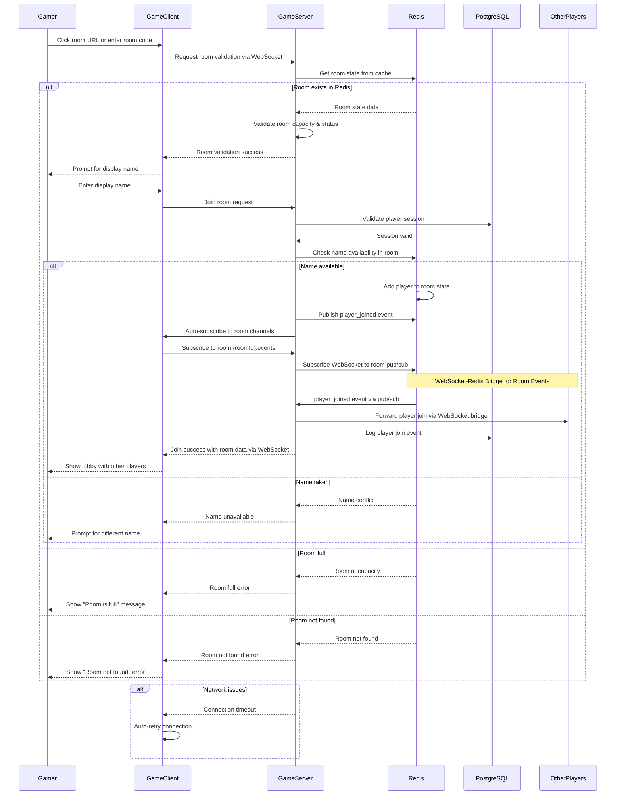

# UC-G001: Join Game Room - Sequence Diagram

```mermaid
sequenceDiagram
    participant Gamer
    participant GameClient
    participant GameServer
    participant Redis
    participant PostgreSQL
    participant OtherPlayers

    Gamer->>GameClient: Click room URL or enter room code
    GameClient->>GameServer: Request room validation via WebSocket
    GameServer->>Redis: Get room state from cache
    
    alt Room exists in Redis
        Redis-->>GameServer: Room state data
        GameServer->>GameServer: Validate room capacity & status
        GameServer-->>GameClient: Room validation success
        GameClient-->>Gamer: Prompt for display name
        
        Gamer->>GameClient: Enter display name
        GameClient->>GameServer: Join room request
        GameServer->>PostgreSQL: Validate player session
        PostgreSQL-->>GameServer: Session valid
        GameServer->>Redis: Check name availability in room
        
        alt Name available
            Redis->>Redis: Add player to room state
            GameServer->>Redis: Publish player_joined event
            GameServer->>GameClient: Auto-subscribe to room channels
            GameClient->>GameServer: Subscribe to room:{roomId}:events
            GameServer->>Redis: Subscribe WebSocket to room pub/sub
            
            Note over Redis,OtherPlayers: WebSocket-Redis Bridge for Room Events
            Redis->>GameServer: player_joined event via pub/sub
            GameServer->>OtherPlayers: Forward player join via WebSocket bridge
            GameServer->>PostgreSQL: Log player join event
            GameServer-->>GameClient: Join success with room data via WebSocket
            GameClient-->>Gamer: Show lobby with other players
        else Name taken
            Redis-->>GameServer: Name conflict
            GameServer-->>GameClient: Name unavailable
            GameClient-->>Gamer: Prompt for different name
        end
    else Room full
        Redis-->>GameServer: Room at capacity
        GameServer-->>GameClient: Room full error
        GameClient-->>Gamer: Show "Room is full" message
    else Room not found
        Redis-->>GameServer: Room not found
        GameServer-->>GameClient: Room not found error
        GameClient-->>Gamer: Show "Room not found" error
    end

    alt Network issues
        GameServer-->>GameClient: Connection timeout
        GameClient->>GameClient: Auto-retry connection
    end
```