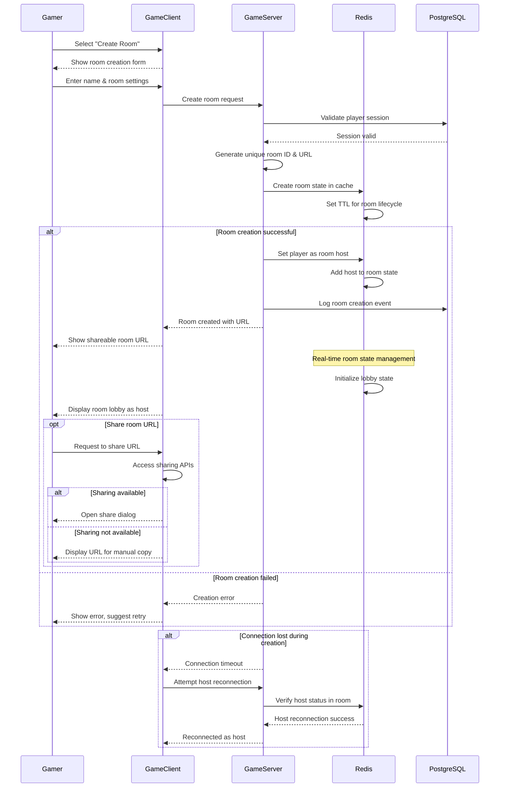

# UC-G002: Create Game Room - Sequence Diagram

```mermaid
sequenceDiagram
    participant Gamer
    participant GameClient
    participant GameServer
    participant Redis
    participant PostgreSQL

    Gamer->>GameClient: Select "Create Room"
    GameClient-->>Gamer: Show room creation form
    Gamer->>GameClient: Enter name & room settings
    
    GameClient->>GameServer: Create room request
    GameServer->>PostgreSQL: Validate player session
    PostgreSQL-->>GameServer: Session valid
    GameServer->>GameServer: Generate unique room ID & URL
    GameServer->>Redis: Create room state in cache
    Redis->>Redis: Set TTL for room lifecycle
    
    alt Room creation successful
        GameServer->>Redis: Set player as room host
        Redis->>Redis: Add host to room state
        GameServer->>PostgreSQL: Log room creation event
        GameServer-->>GameClient: Room created with URL
        GameClient-->>Gamer: Show shareable room URL
        
        Note over Redis: Real-time room state management
        Redis->>Redis: Initialize lobby state
        GameClient-->>Gamer: Display room lobby as host
        
        opt Share room URL
            Gamer->>GameClient: Request to share URL
            GameClient->>GameClient: Access sharing APIs
            
            alt Sharing available
                GameClient-->>Gamer: Open share dialog
            else Sharing not available
                GameClient-->>Gamer: Display URL for manual copy
            end
        end
    else Room creation failed
        GameServer-->>GameClient: Creation error
        GameClient-->>Gamer: Show error, suggest retry
    end

    alt Connection lost during creation
        GameServer-->>GameClient: Connection timeout
        GameClient->>GameServer: Attempt host reconnection
        GameServer->>Redis: Verify host status in room
        Redis-->>GameServer: Host reconnection success
        GameServer-->>GameClient: Reconnected as host
    end
```