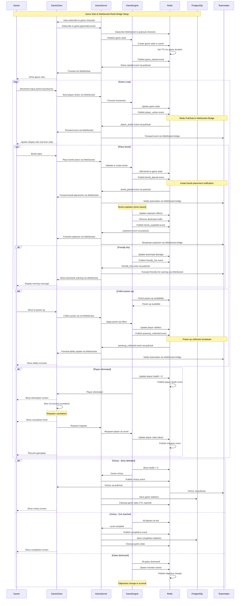

# UC-G003: Play Cooperative Game - Sequence Diagram

```mermaid
sequenceDiagram
    participant Gamer
    participant GameClient
    participant GameServer
    participant GameEngine
    participant Redis
    participant PostgreSQL
    participant Teammates

    Note over Gamer,PostgreSQL: Game Start & WebSocket-Redis Bridge Setup
    GameServer->>GameClient: Auto-subscribe to game channels
    GameClient->>GameServer: Subscribe to game:{gameId}:events
    GameServer->>Redis: Subscribe WebSocket to pub/sub channels
    GameServer->>GameEngine: Initialize game state
    GameEngine->>Redis: Create game state in cache
    Redis->>Redis: Set TTL for game duration
    GameEngine->>Redis: Publish game_started event
    Redis->>GameServer: Game started event via pub/sub
    GameServer->>GameClient: Forward via WebSocket
    GameClient-->>Gamer: Show game view

    loop Game Loop
        Gamer->>GameClient: Movement input (arrow keys/touch)
        GameClient->>GameServer: Send player action via WebSocket
        GameServer->>GameEngine: Process movement
        GameEngine->>Redis: Update game state
        GameEngine->>Redis: Publish player_action event
        
        Note over Redis,Teammates: Redis Pub/Sub to WebSocket Bridge
        Redis->>GameServer: player_action event via pub/sub
        GameServer->>GameClient: Forward event via WebSocket
        GameServer->>Teammates: Forward event via WebSocket bridge
        GameClient-->>Gamer: Update display with real-time state
        
        opt Place bomb
            Gamer->>GameClient: Bomb input
            GameClient->>GameServer: Place bomb action via WebSocket
            GameServer->>GameEngine: Validate & create bomb
            GameEngine->>Redis: Add bomb to game state
            GameEngine->>Redis: Publish bomb_placed event
            
            Note over Redis,Teammates: Instant bomb placement notification
            Redis->>GameServer: bomb_placed event via pub/sub
            GameServer->>GameClient: Forward bomb placement via WebSocket
            GameServer->>Teammates: Notify teammates via WebSocket bridge
            
            Note over GameEngine: Bomb explodes (timer-based)
            GameEngine->>Redis: Update explosion effects
            GameEngine->>Redis: Remove destroyed walls
            GameEngine->>Redis: Publish bomb_exploded event
            
            Redis->>GameServer: explosion event via pub/sub
            GameServer->>GameClient: Forward explosion via WebSocket
            GameServer->>Teammates: Broadcast explosion via WebSocket bridge
            
            alt Friendly fire
                GameEngine->>Redis: Update teammate damage
                GameEngine->>Redis: Publish friendly_fire event
                Redis->>GameServer: friendly_fire event via pub/sub
                GameServer->>Teammates: Forward friendly fire warning via WebSocket
                GameServer->>GameClient: Show teamwork warning via WebSocket
                GameClient-->>Gamer: Display warning message
            end
        end
        
        opt Collect power-up
            GameEngine->>Redis: Check power-up availability
            Redis-->>GameEngine: Power-up available
            Gamer->>GameClient: Move to power-up
            GameClient->>GameServer: Collect power-up via WebSocket
            GameServer->>GameEngine: Apply power-up effect
            GameEngine->>Redis: Update player abilities
            GameEngine->>Redis: Publish powerup_collected event
            
            Note over Redis,Teammates: Power-up collection broadcast
            Redis->>GameServer: powerup_collected event via pub/sub
            GameServer->>GameClient: Forward ability update via WebSocket
            GameServer->>Teammates: Notify teammates via WebSocket bridge
            GameClient-->>Gamer: Show ability increase
        end
        
        alt Player eliminated
            GameEngine->>Redis: Update player health = 0
            Redis->>Redis: Publish player death event
            GameEngine->>GameClient: Player eliminated
            GameClient-->>Gamer: Show elimination screen
            GameClient->>GameClient: Start 10-second countdown
            
            Note over GameClient: Respawn countdown
            GameClient-->>Gamer: Show countdown timer
            GameClient->>GameServer: Request respawn
            GameServer->>GameEngine: Respawn player at corner
            GameEngine->>Redis: Update player state (alive)
            Redis->>Redis: Publish respawn event
            GameClient-->>Gamer: Resume gameplay
        end
    end

    alt Victory - Boss defeated
        GameEngine->>Redis: Boss health = 0
        GameEngine->>GameServer: Game victory
        GameServer->>Redis: Publish victory event
        Redis->>GameClient: Victory via pub/sub
        Redis->>Teammates: Victory via pub/sub
        GameServer->>PostgreSQL: Save game statistics
        GameServer->>Redis: Cleanup game state (TTL expired)
        GameClient-->>Gamer: Show victory screen
    else Victory - Exit reached
        GameEngine->>Redis: All players at exit
        GameEngine->>GameServer: Level complete
        GameServer->>Redis: Publish completion event
        GameServer->>PostgreSQL: Save completion statistics
        GameServer->>Redis: Cleanup game state
        GameClient-->>Gamer: Show completion screen
    else Gates destroyed
        GameEngine->>Redis: All gates destroyed
        GameEngine->>Redis: Spawn monster waves
        Redis->>Redis: Publish objective change
        Note over GameEngine: Objectives change to survival
    end
```