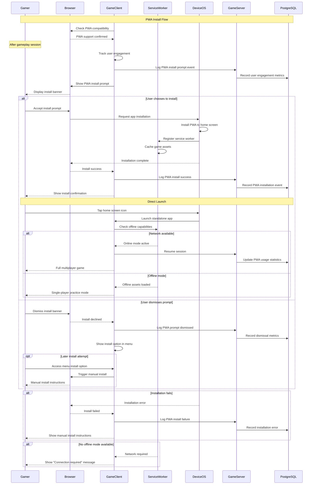

# UC-G005: Install as PWA - Sequence Diagram

```mermaid
sequenceDiagram
    participant Gamer
    participant Browser
    participant GameClient
    participant ServiceWorker
    participant DeviceOS
    participant GameServer
    participant PostgreSQL

    Note over Gamer,PostgreSQL: PWA Install Flow
    GameClient->>Browser: Check PWA compatibility
    Browser-->>GameClient: PWA support confirmed
    
    Note over Gamer: After gameplay session
    GameClient->>GameClient: Track user engagement
    GameClient->>GameServer: Log PWA install prompt event
    GameServer->>PostgreSQL: Record user engagement metrics
    GameClient->>Browser: Show PWA install prompt
    Browser-->>Gamer: Display install banner
    
    alt User chooses to install
        Gamer->>Browser: Accept install prompt
        Browser->>DeviceOS: Request app installation
        DeviceOS->>DeviceOS: Install PWA to home screen
        DeviceOS->>ServiceWorker: Register service worker
        ServiceWorker->>ServiceWorker: Cache game assets
        DeviceOS-->>Browser: Installation complete
        Browser-->>GameClient: Install success
        GameClient->>GameServer: Log PWA install success
        GameServer->>PostgreSQL: Record PWA installation event
        GameClient-->>Gamer: Show install confirmation
        
        Note over Gamer,PostgreSQL: Direct Launch
        Gamer->>DeviceOS: Tap home screen icon
        DeviceOS->>GameClient: Launch standalone app
        GameClient->>ServiceWorker: Check offline capabilities
        
        alt Network available
            ServiceWorker-->>GameClient: Online mode active
            GameClient->>GameServer: Resume session
            GameServer->>PostgreSQL: Update PWA usage statistics
            GameClient-->>Gamer: Full multiplayer game
        else Offline mode
            ServiceWorker-->>GameClient: Offline assets loaded
            GameClient-->>Gamer: Single-player practice mode
        end
    else User dismisses prompt
        Gamer->>Browser: Dismiss install banner
        Browser-->>GameClient: Install declined
        GameClient->>GameServer: Log PWA prompt dismissed
        GameServer->>PostgreSQL: Record dismissal metrics
        GameClient->>GameClient: Show install option in menu
        
        opt Later install attempt
            Gamer->>GameClient: Access menu install option
            GameClient->>Browser: Trigger manual install
            Browser-->>Gamer: Manual install instructions
        end
    end

    alt Installation fails
        DeviceOS-->>Browser: Installation error
        Browser-->>GameClient: Install failed
        GameClient->>GameServer: Log PWA install failure
        GameServer->>PostgreSQL: Record installation error
        GameClient-->>Gamer: Show manual install instructions
    end

    alt No offline mode available
        ServiceWorker-->>GameClient: Network required
        GameClient-->>Gamer: Show "Connection required" message
    end
```