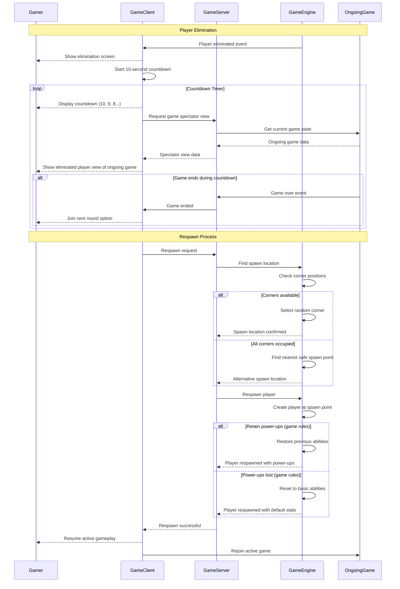

# UC-G006: Respawn After Elimination - Sequence Diagram

```mermaid
sequenceDiagram
    participant Gamer
    participant GameClient
    participant GameServer
    participant GameEngine
    participant OngoingGame

    Note over Gamer,OngoingGame: Player Elimination
    GameEngine->>GameClient: Player eliminated event
    GameClient-->>Gamer: Show elimination screen
    GameClient->>GameClient: Start 10-second countdown
    
    loop Countdown Timer
        GameClient-->>Gamer: Display countdown (10, 9, 8...)
        GameClient->>GameServer: Request game spectator view
        GameServer->>OngoingGame: Get current game state
        OngoingGame-->>GameServer: Ongoing game data
        GameServer-->>GameClient: Spectator view data
        GameClient-->>Gamer: Show eliminated player view of ongoing game
        
        alt Game ends during countdown
            OngoingGame->>GameServer: Game over event
            GameServer->>GameClient: Game ended
            GameClient-->>Gamer: Join next round option
        end
    end

    Note over Gamer,OngoingGame: Respawn Process
    GameClient->>GameServer: Respawn request
    GameServer->>GameEngine: Find spawn location
    
    GameEngine->>GameEngine: Check corner positions
    alt Corners available
        GameEngine->>GameEngine: Select random corner
        GameEngine-->>GameServer: Spawn location confirmed
    else All corners occupied
        GameEngine->>GameEngine: Find nearest safe spawn point
        GameEngine-->>GameServer: Alternative spawn location
    end
    
    GameServer->>GameEngine: Respawn player
    GameEngine->>GameEngine: Create player at spawn point
    
    alt Retain power-ups (game rules)
        GameEngine->>GameEngine: Restore previous abilities
        GameEngine-->>GameServer: Player respawned with power-ups
    else Power-ups lost (game rules)
        GameEngine->>GameEngine: Reset to basic abilities
        GameEngine-->>GameServer: Player respawned with default stats
    end
    
    GameServer-->>GameClient: Respawn successful
    GameClient-->>Gamer: Resume active gameplay
    GameClient->>OngoingGame: Rejoin active game
```