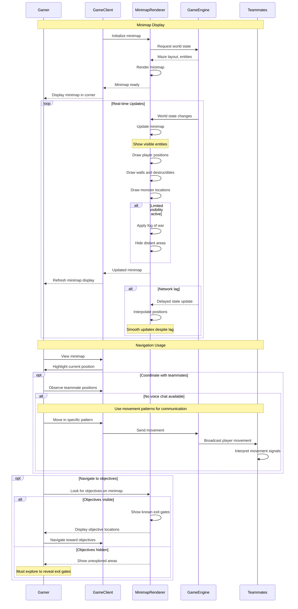

# UC-G007: Use Minimap Navigation - Sequence Diagram

```mermaid
sequenceDiagram
    participant Gamer
    participant GameClient
    participant MinimapRenderer
    participant GameEngine
    participant Teammates

    Note over Gamer,Teammates: Minimap Display
    GameClient->>MinimapRenderer: Initialize minimap
    MinimapRenderer->>GameEngine: Request world state
    GameEngine-->>MinimapRenderer: Maze layout, entities
    MinimapRenderer->>MinimapRenderer: Render minimap
    MinimapRenderer-->>GameClient: Minimap ready
    GameClient-->>Gamer: Display minimap in corner

    loop Real-time Updates
        GameEngine->>MinimapRenderer: World state changes
        MinimapRenderer->>MinimapRenderer: Update minimap
        
        Note over MinimapRenderer: Show visible entities
        MinimapRenderer->>MinimapRenderer: Draw player positions
        MinimapRenderer->>MinimapRenderer: Draw walls and destructibles
        MinimapRenderer->>MinimapRenderer: Draw monster locations
        
        alt Limited visibility active
            MinimapRenderer->>MinimapRenderer: Apply fog of war
            MinimapRenderer->>MinimapRenderer: Hide distant areas
        end
        
        MinimapRenderer-->>GameClient: Updated minimap
        GameClient-->>Gamer: Refresh minimap display
        
        alt Network lag
            GameEngine-->>MinimapRenderer: Delayed state update
            MinimapRenderer->>MinimapRenderer: Interpolate positions
            Note over MinimapRenderer: Smooth updates despite lag
        end
    end

    Note over Gamer,Teammates: Navigation Usage
    Gamer->>GameClient: View minimap
    GameClient->>Gamer: Highlight current position
    
    opt Coordinate with teammates
        Gamer->>GameClient: Observe teammate positions
        
        alt No voice chat available
            Note over Gamer,Teammates: Use movement patterns for communication
            Gamer->>GameClient: Move in specific pattern
            GameClient->>GameEngine: Send movement
            GameEngine->>Teammates: Broadcast player movement
            Teammates->>Teammates: Interpret movement signals
        end
    end

    opt Navigate to objectives
        Gamer->>MinimapRenderer: Look for objectives on minimap
        
        alt Objectives visible
            MinimapRenderer->>MinimapRenderer: Show known exit gates
            MinimapRenderer-->>Gamer: Display objective locations
            Gamer->>GameClient: Navigate toward objectives
        else Objectives hidden
            MinimapRenderer-->>Gamer: Show unexplored areas
            Note over Gamer: Must explore to reveal exit gates
        end
    end
```