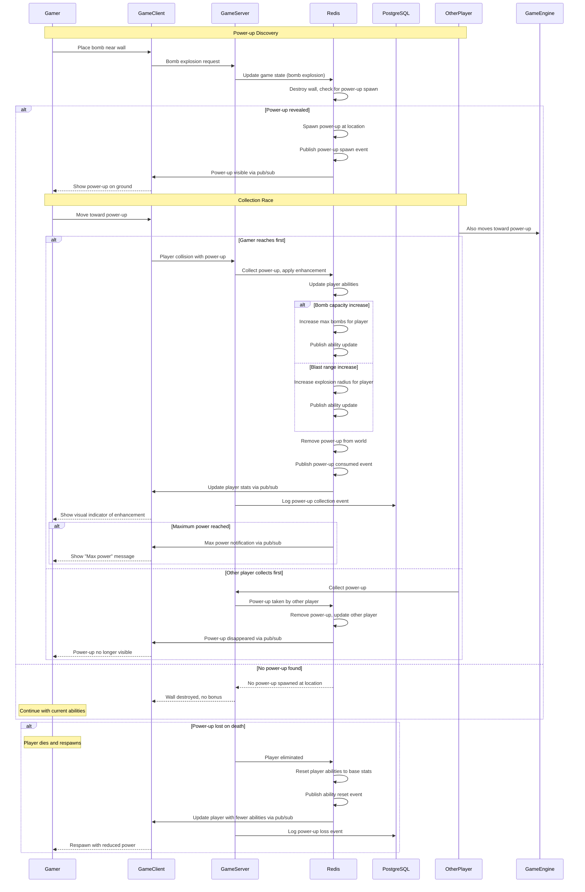

# UC-G008: Collect Power-ups - Sequence Diagram

```mermaid
sequenceDiagram
    participant Gamer
    participant GameClient
    participant GameServer
    participant Redis
    participant PostgreSQL
    participant OtherPlayer

    Note over Gamer,OtherPlayer: Power-up Discovery
    Gamer->>GameClient: Place bomb near wall
    GameClient->>GameServer: Bomb explosion request
    GameServer->>Redis: Update game state (bomb explosion)
    Redis->>Redis: Destroy wall, check for power-up spawn
    
    alt Power-up revealed
        Redis->>Redis: Spawn power-up at location
        Redis->>Redis: Publish power-up spawn event
        Redis->>GameClient: Power-up visible via pub/sub
        GameClient-->>Gamer: Show power-up on ground
        
        Note over Gamer,OtherPlayer: Collection Race
        Gamer->>GameClient: Move toward power-up
        OtherPlayer->>GameEngine: Also moves toward power-up
        
        alt Gamer reaches first
            GameClient->>GameServer: Player collision with power-up
            GameServer->>Redis: Collect power-up, apply enhancement
            Redis->>Redis: Update player abilities
            
            alt Bomb capacity increase
                Redis->>Redis: Increase max bombs for player
                Redis->>Redis: Publish ability update
            else Blast range increase
                Redis->>Redis: Increase explosion radius for player
                Redis->>Redis: Publish ability update
            end
            
            Redis->>Redis: Remove power-up from world
            Redis->>Redis: Publish power-up consumed event
            Redis->>GameClient: Update player stats via pub/sub
            GameServer->>PostgreSQL: Log power-up collection event
            GameClient-->>Gamer: Show visual indicator of enhancement
            
            alt Maximum power reached
                Redis->>GameClient: Max power notification via pub/sub
                GameClient-->>Gamer: Show "Max power" message
            end
        else Other player collects first
            OtherPlayer->>GameServer: Collect power-up
            GameServer->>Redis: Power-up taken by other player
            Redis->>Redis: Remove power-up, update other player
            Redis->>GameClient: Power-up disappeared via pub/sub
            GameClient-->>Gamer: Power-up no longer visible
        end
    else No power-up found
        Redis-->>GameServer: No power-up spawned at location
        GameServer-->>GameClient: Wall destroyed, no bonus
        Note over Gamer: Continue with current abilities
    end

    alt Power-up lost on death
        Note over Gamer: Player dies and respawns
        GameServer->>Redis: Player eliminated
        Redis->>Redis: Reset player abilities to base stats
        Redis->>Redis: Publish ability reset event
        Redis->>GameClient: Update player with fewer abilities via pub/sub
        GameServer->>PostgreSQL: Log power-up loss event
        GameClient-->>Gamer: Respawn with reduced power
    end
```