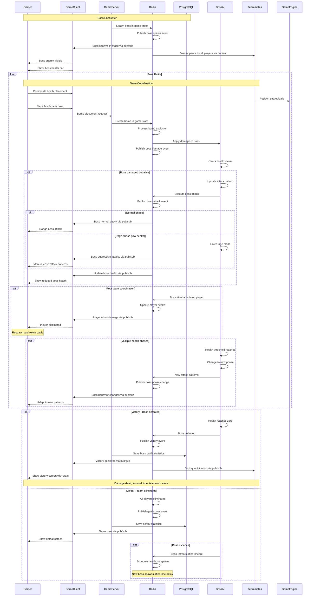

# UC-G009: Defeat Boss Enemy - Sequence Diagram

```mermaid
sequenceDiagram
    participant Gamer
    participant GameClient
    participant GameServer
    participant Redis
    participant PostgreSQL
    participant BossAI
    participant Teammates

    Note over Gamer,PostgreSQL: Boss Encounter
    GameServer->>Redis: Spawn boss in game state
    Redis->>Redis: Publish boss spawn event
    Redis->>GameClient: Boss spawns in maze via pub/sub
    Redis->>Teammates: Boss appears for all players via pub/sub
    GameClient-->>Gamer: Boss enemy visible
    GameClient-->>Gamer: Show boss health bar

    loop Boss Battle
        Note over Gamer,Teammates: Team Coordination
        Gamer->>GameClient: Coordinate bomb placement
        Teammates->>GameEngine: Position strategically
        
        Gamer->>GameClient: Place bomb near boss
        GameClient->>GameServer: Bomb placement request
        GameServer->>Redis: Create bomb in game state
        Redis->>Redis: Process bomb explosion
        Redis->>BossAI: Apply damage to boss
        Redis->>Redis: Publish boss damage event
        
        BossAI->>BossAI: Check health status
        alt Boss damaged but alive
            BossAI->>BossAI: Update attack pattern
            BossAI->>Redis: Execute boss attack
            Redis->>Redis: Publish boss attack event
            
            alt Normal phase
                Redis->>GameClient: Boss normal attack via pub/sub
                GameClient-->>Gamer: Dodge boss attack
            else Rage phase (low health)
                BossAI->>BossAI: Enter rage mode
                Redis->>GameClient: Boss aggressive attacks via pub/sub
                GameClient-->>Gamer: More intense attack patterns
            end
            
            Redis->>GameClient: Update boss health via pub/sub
            GameClient-->>Gamer: Show reduced boss health
        end

        alt Poor team coordination
            BossAI->>Redis: Boss attacks isolated player
            Redis->>Redis: Update player health
            Redis->>GameClient: Player takes damage via pub/sub
            GameClient-->>Gamer: Player eliminated
            Note over Gamer: Respawn and rejoin battle
        end

        opt Multiple health phases
            BossAI->>BossAI: Health threshold reached
            BossAI->>BossAI: Change to next phase
            BossAI->>Redis: New attack patterns
            Redis->>Redis: Publish boss phase change
            Redis->>GameClient: Boss behavior changes via pub/sub
            GameClient-->>Gamer: Adapt to new patterns
        end
    end

    alt Victory - Boss defeated
        BossAI->>BossAI: Health reaches zero
        BossAI->>Redis: Boss defeated
        Redis->>Redis: Publish victory event
        GameServer->>PostgreSQL: Save boss battle statistics
        Redis->>GameClient: Victory achieved via pub/sub
        Redis->>Teammates: Victory notification via pub/sub
        GameClient-->>Gamer: Show victory screen with stats
        
        Note over Gamer,Teammates: Damage dealt, survival time, teamwork score
    else Defeat - Team eliminated
        Redis->>Redis: All players eliminated
        Redis->>Redis: Publish game over event
        GameServer->>PostgreSQL: Save defeat statistics
        Redis->>GameClient: Game over via pub/sub
        GameClient-->>Gamer: Show defeat screen
        
        opt Boss escapes
            BossAI->>Redis: Boss retreats after timeout
            Redis->>Redis: Schedule new boss spawn
            Note over Redis: New boss spawns after time delay
        end
    end
```