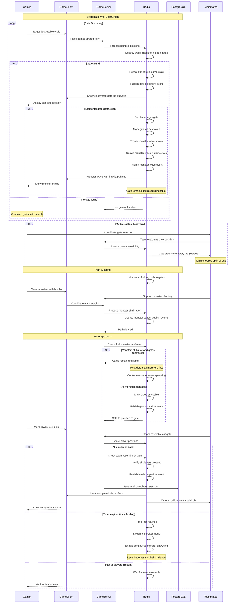

# UC-G010: Find Exit Gates - Sequence Diagram

```mermaid
sequenceDiagram
    participant Gamer
    participant GameClient
    participant GameServer
    participant Redis
    participant PostgreSQL
    participant Teammates

    Note over Gamer,PostgreSQL: Systematic Wall Destruction
    loop Gate Discovery
        Gamer->>GameClient: Target destructible walls
        GameClient->>GameServer: Place bombs strategically
        GameServer->>Redis: Process bomb explosions
        Redis->>Redis: Destroy walls, check for hidden gates
        
        alt Gate found
            Redis->>Redis: Reveal exit gate in game state
            Redis->>Redis: Publish gate discovery event
            Redis->>GameClient: Show discovered gate via pub/sub
            GameClient-->>Gamer: Display exit gate location
            
            alt Accidental gate destruction
                Redis->>Redis: Bomb damages gate
                Redis->>Redis: Mark gate as destroyed
                Redis->>Redis: Trigger monster wave spawn
                Redis->>Redis: Spawn monster wave in game state
                Redis->>Redis: Publish monster wave event
                Redis->>GameClient: Monster wave warning via pub/sub
                GameClient-->>Gamer: Show monster threat
                
                Note over Redis: Gate remains destroyed (unusable)
            end
        else No gate found
            Redis-->>GameServer: No gate at location
            Note over Gamer: Continue systematic search
        end
    end

    alt Multiple gates discovered
        Gamer->>Teammates: Coordinate gate selection
        Teammates->>GameServer: Team evaluates gate positions
        GameServer->>Redis: Assess gate accessibility
        Redis-->>Teammates: Gate status and safety via pub/sub
        Note over Teammates: Team chooses optimal exit
    end

    Note over Gamer,PostgreSQL: Path Clearing
    Redis->>Redis: Monsters blocking path to gates
    Gamer->>GameClient: Clear monsters with bombs
    Teammates->>GameServer: Support monster clearing
    GameClient->>GameServer: Coordinate team attacks
    GameServer->>Redis: Process monster elimination
    Redis->>Redis: Update monster states, publish events
    Redis-->>GameServer: Path cleared

    Note over Gamer,PostgreSQL: Gate Approach
    GameServer->>Redis: Check if all monsters defeated
    alt Monsters still alive and gates destroyed
        Redis-->>GameServer: Gates remain unusable
        Note over Redis: Must defeat all monsters first
        Redis->>Redis: Continue monster wave spawning
    else All monsters defeated
        Redis->>Redis: Mark gates as usable
        Redis->>Redis: Publish gate activation event
        Redis-->>GameServer: Safe to proceed to gate
    end

    Gamer->>GameClient: Move toward exit gate
    Teammates->>GameServer: Team assembles at gate
    GameServer->>Redis: Update player positions
    
    alt All players at gate
        GameServer->>Redis: Check team assembly at gate
        Redis->>Redis: Verify all players present
        Redis->>Redis: Publish level completion event
        GameServer->>PostgreSQL: Save level completion statistics
        Redis->>GameClient: Level completed via pub/sub
        Redis->>Teammates: Victory notification via pub/sub
        GameClient-->>Gamer: Show completion screen
    else Timer expires (if applicable)
        Redis->>Redis: Time limit reached
        Redis->>Redis: Switch to survival mode
        Redis->>Redis: Enable continuous monster spawning
        Note over Redis: Level becomes survival challenge
    else Not all players present
        Redis->>Redis: Wait for team assembly
        GameClient-->>Gamer: Wait for teammates
    end
```