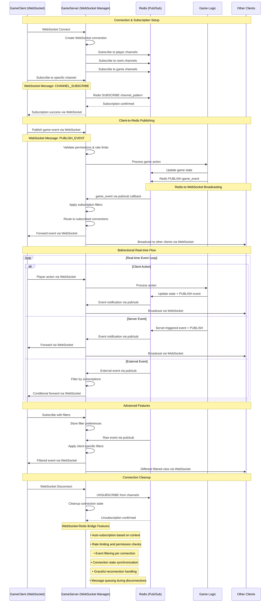

# WebSocket-Redis Pub/Sub Integration - Technical Sequence Diagram

This diagram shows the detailed flow of how WebSocket connections integrate with Redis pub/sub channels for real-time bidirectional messaging.

## Key Integration Points

### 1. **Connection Establishment**
- WebSocket connection automatically subscribes to relevant Redis channels
- Context-aware subscriptions (room, game, player-specific channels)
- Connection state tracked for proper cleanup

### 2. **Bidirectional Messaging**
- **Client → Redis**: WebSocket messages validated and published to Redis
- **Redis → Client**: Redis pub/sub events forwarded via WebSocket
- **Real-time synchronization** across all connected clients

### 3. **Event Filtering**
- Subscription-level filtering for bandwidth optimization
- Client-specific event routing based on permissions
- Dynamic filter updates during gameplay

### 4. **Performance Optimizations**
- Connection pooling for Redis subscriptions
- Event batching for high-frequency updates
- Selective broadcasting based on relevance

### 5. **Reliability Features**
- Automatic reconnection handling
- Message queuing during brief disconnections
- Graceful degradation during Redis unavailability

This architecture enables **millisecond-latency** real-time multiplayer gaming while maintaining scalability through Redis clustering and WebSocket load balancing.