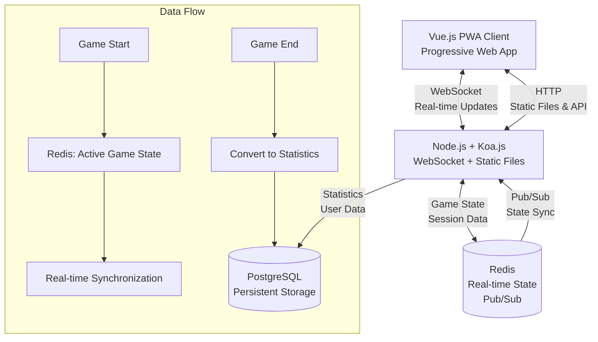
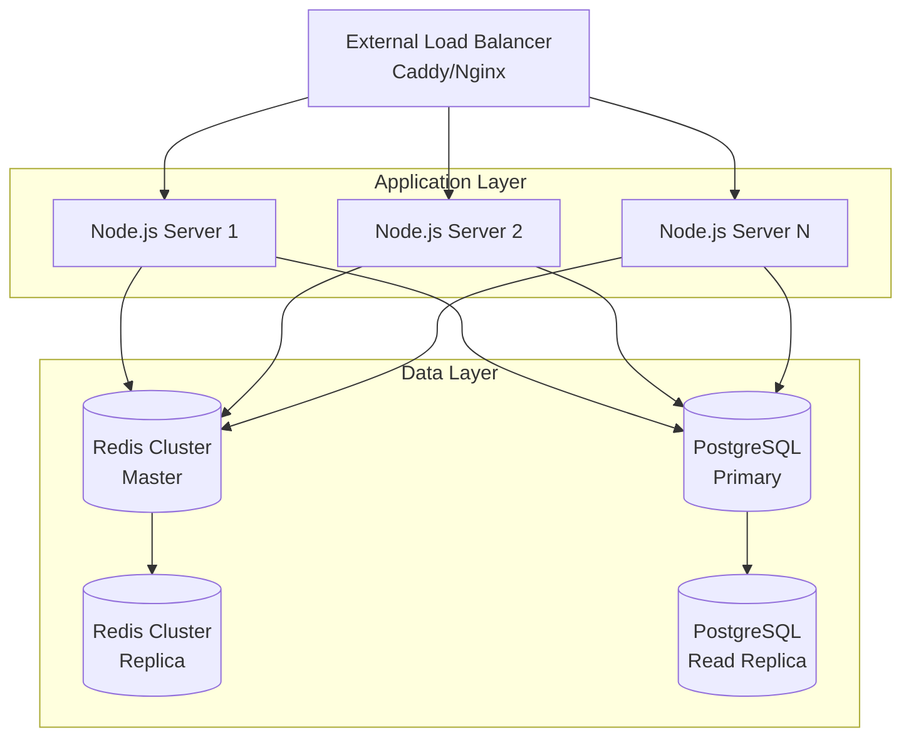

# Technical Stack

This document outlines the complete technology stack for the cooperative multiplayer Bomberman game, including the rationale for each technology choice and their roles in the system architecture.

## Architecture Overview

The system uses a **dual-storage architecture** with different technologies optimized for specific use cases:

- **PostgreSQL** - Persistent storage for users, game statistics, and long-term data
- **Redis** - High-speed state synchronization and real-time game data
- **WebSocket** - Real-time bidirectional communication
- **Vue.js** - Reactive frontend with PWA capabilities



---

## Frontend Technologies

### Vue.js 3 (Composition API)
**Role**: Primary frontend framework for reactive user interfaces

**Why Vue.js**:
- **Reactive Data Binding**: Perfect for real-time game state updates
- **Composition API**: Better TypeScript integration and code organization
- **Small Bundle Size**: Critical for mobile performance
- **Progressive Enhancement**: Can be adopted incrementally
- **PWA Support**: Excellent tooling for Progressive Web Apps

**Responsibilities**:
- Game rendering and UI management
- WebSocket client coordination
- State management (via Vuex/Pinia)
- Component-based architecture
- Mobile-responsive interface

### HTML5 Canvas
**Role**: High-performance 2D game rendering

**Why Canvas**:
- **Performance**: Hardware-accelerated graphics for smooth gameplay
- **Flexibility**: Full control over rendering pipeline
- **Animation Support**: Smooth sprite animations and particle effects
- **Cross-platform**: Consistent rendering across devices

**Responsibilities**:
- Game world rendering (players, bombs, maze)
- Particle effects and explosions
- Minimap rendering
- Animation systems

### PWA Technologies
**Role**: Native app experience on mobile and desktop

**Components**:
- **Service Workers**: Offline functionality and asset caching
- **Web App Manifest**: App installation and metadata
- **Cache API**: Strategic caching for performance
- **Push Notifications**: Game invitations and updates

**Responsibilities**:
- App installation prompts
- Offline practice mode
- Background synchronization
- Push notifications for multiplayer invitations

### TypeScript
**Role**: Type safety and developer experience across frontend and backend

**Why TypeScript**:
- **Type Safety**: Catch errors at compile time
- **IntelliSense**: Better IDE support and autocomplete
- **Refactoring**: Safe code refactoring at scale
- **Interface Contracts**: Clear contracts between modules

---

## Backend Technologies

### Node.js
**Role**: JavaScript runtime for server-side execution

**Why Node.js**:
- **Single Language**: JavaScript/TypeScript across full stack
- **Event-Driven**: Perfect for real-time multiplayer architecture
- **NPM Ecosystem**: Rich package ecosystem
- **Performance**: Fast I/O operations for game servers

### Koa.js
**Role**: Lightweight web application framework

**Why Koa.js over Express**:
- **Modern Async/Await**: Better async handling than Express
- **Lightweight**: Minimal footprint, maximum performance
- **Middleware Composition**: Clean, composable middleware
- **Error Handling**: Better error handling mechanisms
- **WebSocket Integration**: Clean WebSocket middleware support

**Responsibilities**:
- HTTP API endpoints
- WebSocket connection handling
- Middleware pipeline (auth, validation, logging)
- Static file serving

### WebSocket (ws library)
**Role**: Real-time bidirectional communication

**Why WebSocket**:
- **Low Latency**: Essential for real-time multiplayer games
- **Bidirectional**: Full-duplex communication
- **Connection Persistence**: Maintains connection state
- **Event-Driven**: Perfect for game events

**Responsibilities**:
- Real-time player actions
- Game state synchronization
- Chat messaging
- Room management updates
- Admin notifications

---

## Data Storage Technologies

### PostgreSQL
**Role**: Primary persistent database for long-term data storage

**Why PostgreSQL**:
- **ACID Compliance**: Reliable transactions for critical data
- **JSON Support**: Flexible schema for game statistics
- **Performance**: Excellent query optimization
- **Extensibility**: Rich extension ecosystem
- **Reliability**: Battle-tested for production systems

**Data Storage**:
```sql
-- Core persistent entities
Tables:
├── users (players, admins)
├── user_sessions (authentication)
├── user_statistics (lifetime stats)
├── user_achievements (unlocked achievements)
├── game_history (completed games)
├── game_statistics (final game stats)
├── audit_logs (admin actions)
├── system_configuration (settings)
└── reports (generated analytics)
```

**Responsibilities**:
- Player accounts and authentication
- Lifetime statistics and achievements
- Game history and analytics
- Admin audit trails
- System configuration
- Historical reporting data

### Redis
**Role**: High-speed state synchronization and session management

**Why Redis**:
- **In-Memory Performance**: Sub-millisecond response times
- **Pub/Sub**: Built-in publish/subscribe for real-time updates
- **Data Structures**: Rich data types (hashes, lists, sets)
- **Persistence Options**: Configurable durability
- **Horizontal Scaling**: Cluster support for growth

**Data Storage**:
```redis
# Real-time game data (TTL: game duration)
game:{gameId} = {
  status, players, bombs, powerups, monsters, maze_state
}

# Player sessions (TTL: session timeout)
session:{sessionId} = {
  playerId, roomId, gameId, connectionId, lastActivity
}

# Room states (TTL: room lifetime)
room:{roomId} = {
  players, settings, lobby_state, chat_history
}

# Active connections
connections:{serverId} = Set of connectionIds

# Real-time pub/sub channels
game_updates:{gameId}    # Game state changes
room_updates:{roomId}    # Room/lobby changes
player_actions:{gameId}  # Player input actions
admin_notifications      # System-wide admin messages
```

**Responsibilities**:
- Active game state management
- Real-time state synchronization via Pub/Sub
- Player session management
- Room and lobby states
- WebSocket connection tracking
- Message queuing and buffering

---

## State Synchronization Architecture

### Real-time Data Flow

```typescript
// Game state update cycle
1. Player Action → WebSocket → Server
2. Server → Game Engine (validate & process)
3. Game Engine → Redis (update state)
4. Redis Pub/Sub → All connected clients
5. Clients → Update local state & render

// Persistence workflow
Game End → Redis state → PostgreSQL statistics
```

### Data Transformation Pipeline

**Active Game State (Redis)**:
```typescript
interface ActiveGameState {
  gameId: string;
  roomId: string;
  players: Map<string, PlayerGameState>;
  bombs: Map<string, Bomb>;
  powerups: PowerUp[];
  monsters: Monster[];
  maze: MazeState;
  events: RecentEvent[]; // Last 100 events
  lastUpdate: timestamp;
}
```

**Game Completion Processing**:
```typescript
// When game ends:
1. Extract final statistics from Redis state
2. Calculate player performance metrics
3. Update lifetime statistics in PostgreSQL
4. Store compressed game history
5. Clean up Redis game data
6. Trigger achievement calculations
```

### Pub/Sub Message Types

```typescript
// Redis channels for real-time synchronization
enum PubSubChannel {
  GAME_STATE = 'game:{gameId}:state',
  PLAYER_ACTIONS = 'game:{gameId}:actions',
  ROOM_UPDATES = 'room:{roomId}:updates',
  PLAYER_SESSION = 'player:{playerId}:session',
  ADMIN_BROADCAST = 'admin:broadcast'
}
```

---

## Development & DevOps Technologies

### Docker
**Role**: Containerization for consistent development and deployment

**Services**:
```yaml
services:
  app:          # Node.js application with static file serving
  postgres:     # PostgreSQL database
  redis:        # Redis cache/pub-sub
```

### Docker Compose
**Role**: Local development environment orchestration

**Benefits**:
- Consistent development environment
- Easy service dependencies
- Simplified testing setup

### Static File Serving
**Role**: Direct static file serving via Node.js application

**Implementation**:
- Koa.js static middleware for serving built Vue.js app
- Direct WebSocket connections to Node.js server
- Prepared for external reverse proxy integration (Caddy/Nginx)
- Localhost-only binding for enhanced security

---

## Testing Technologies

### Vitest
**Role**: Unit and integration testing framework

**Why Vitest**:
- **Vite Integration**: Fast test execution
- **TypeScript Support**: Native TypeScript support
- **Vue Testing**: Excellent Vue.js component testing

### Playwright
**Role**: End-to-end testing for cross-browser compatibility

**Responsibilities**:
- Multi-browser testing (Chrome, Firefox, Safari)
- Mobile responsiveness testing
- PWA functionality testing
- Real-time multiplayer testing

---

## Monitoring & Analytics

### Logging Stack
```typescript
// Structured logging with multiple targets
Logs → Application → {
  Console (development)
  File rotation (production)
  PostgreSQL (audit logs)
  External service (optional: DataDog, LogRocket)
}
```

### Performance Monitoring
- **Application metrics**: Response times, error rates
- **Database metrics**: Query performance, connection pools
- **Redis metrics**: Memory usage, pub/sub throughput
- **WebSocket metrics**: Connection counts, message rates

---

## Security Considerations

### Authentication & Authorization
- **JWT Tokens**: Stateless authentication
- **Session Management**: Redis-backed sessions
- **Rate Limiting**: Per-connection message limits
- **Input Validation**: Comprehensive input sanitization

### Network Security
- **HTTPS/WSS**: Encrypted connections
- **CORS Configuration**: Restricted origins
- **DDoS Protection**: Connection limits and rate limiting
- **Content Security Policy**: XSS prevention

---

## Scalability Architecture

### Horizontal Scaling Strategy



### Performance Optimization

**Redis Optimization**:
- Memory optimization for game states
- Pub/Sub message batching
- Connection pooling
- Cluster sharding for large scale

**PostgreSQL Optimization**:
- Read replicas for analytics
- Connection pooling
- Query optimization
- Partitioning for historical data

**Application Optimization**:
- WebSocket connection pooling
- Message batching and compression
- Efficient game state deltas
- Cached frequently accessed data

---

## Development Workflow

### Package Management
- **npm/yarn**: Dependency management
- **Workspaces**: Monorepo structure for shared types

### Build Process
- **Vite**: Fast frontend build tool
- **TypeScript Compiler**: Type checking and compilation
- **Hot Module Replacement**: Development efficiency

### Code Quality
- **ESLint**: Code linting
- **Prettier**: Code formatting
- **Husky**: Git hooks for quality gates
- **TypeScript**: Compile-time type checking

---

## Technology Versions

```json
{
  "node": "18.x LTS",
  "typescript": "^5.0.0",
  "vue": "^3.3.0",
  "koa": "^2.14.0",
  "ws": "^8.13.0",
  "postgresql": "15.x",
  "redis": "7.x",
  "docker": "20.x"
}
```

This technical stack provides a robust, scalable, and maintainable foundation for the cooperative multiplayer Bomberman game, with clear separation between persistent storage, real-time synchronization, and client-server communication layers.

## Simplified Architecture Benefits

The current stack eliminates internal reverse proxy complexity by:
- **Direct static file serving** from Node.js using Koa.js middleware
- **Localhost-only binding** (127.0.0.1:8080) for enhanced security  
- **External proxy readiness** for production HTTPS termination via Caddy or other reverse proxies
- **Reduced infrastructure overhead** while maintaining all functionality
- **Single-service simplicity** for development and debugging

## TypeScript Development Setup

### TypeScript Configuration
- **Strict mode enabled** with comprehensive type checking
- **Path mapping** configured for clean imports (@types/*, @interfaces/*, etc.)
- **Build configuration** separates development and production builds
- **ES2022 target** with modern JavaScript features
- **Declaration files** generated for API consumption

### Code Quality Tools
- **ESLint** configured for TypeScript with essential rules
- **Prettier** for consistent code formatting
- **Husky** git hooks for automated quality checks
- **tsconfig-paths** for development time path resolution

### Module Architecture
- **Type definitions** in `src/types/` (separate from implementations)
- **Interface definitions** in `src/interfaces/` (API contracts)
- **Stub implementations** in `src/modules/` (actual business logic)
- **Unified exports** through `src/index.d.ts` for easy consumption

### Development Commands
```bash
npm run dev:server     # Start development server with hot reload
npm run build:server   # Build TypeScript to JavaScript
npm run typecheck      # Type checking without output
npm run lint           # ESLint code quality check
npm run lint:fix       # Auto-fix linting issues
```